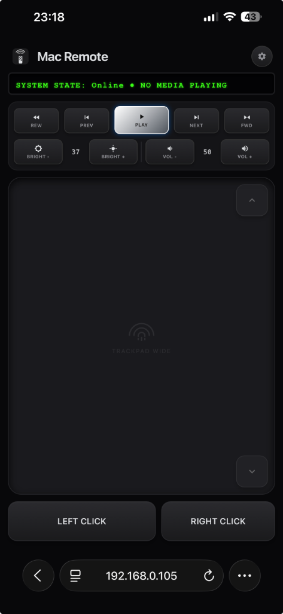

# MacRemote

MacRemote is an open-source, highly-responsive, and secure local application that allows you to control your Mac directly from your iPhone, Android, or any modern web browser.

It leverages a native macOS menu bar app written in Swift and Go, serving a beautiful, hacker-themed, mobile-first web interface to devices on your local network.



## Features
- **Giant Trackpad**: Fluid, low-latency mouse control over your local network using Server-Sent Events (SSE).
- **Media Controls**: Adjust volume, brightness, play/pause, and skip tracks.
- **Secure Pairing Flow**: Device connections require scanning a QR Code from the Mac Menu Bar and entering a live-generated 6-digit OTP code. Unauthenticated traffic is rejected.
- **Device Management**: View and disconnect active devices directly from the Mac Menu Bar.
- **App Switcher**: See running applications and seamlessly switch between them using the built-in dock UI.
- **Accessibility & Keyboard**: Integrated virtual keyboard that triggers natively on your Mac.

## Architecture
This project is built using two core technologies:
1. **Go (Golang)**: Powers the ultra-fast HTTP web server, the SSE streams for trackpad data, and the secure pairing session logic.
2. **Swift**: Provides the native macOS APIs for Accessibility (AXUIElement), media controls, AppleScript execution, and the Menu Bar UI (using `systray`). The Go server interfaces with Swift via Cgo.

## Setup & Compilation

### Requirements
- **macOS** 13.0 or later
- **Go** 1.21+
- **Xcode Command Line Tools** (for the Swift compiler)

### Build Instructions

1. Clone the repository:
   ```bash
   git clone https://github.com/adarshmaurya/mac_remote.git
   cd mac_remote
   ```

2. Compile the application using the included Makefile:
   ```bash
   make build
   ```
   *This command will parse the Swift code into an object file, compile the Go server, link them together, and sign the resulting `MacRemote.app` bundle.*

3. Run the application:
   ```bash
   open MacRemote.app
   ```

> **Accessibility Permissions**
> MacRemote requires Accessibility permissions to control the mouse, keyboard, and system UI. Upon running the app for the first time, click "Grant Accessibility Permission" from the menu bar to open System Settings, and ensure MacRemote is toggled ON.

## Running Tests
To run the automated test suite covering the pairing logic, HTTP middleware, and API endpoints:
```bash
make test
```

## Security
MacRemote is designed to only operate on your local area network (LAN). It utilizes HTTP-only cookies and robust brute-force protection (lockout after 5 failed OTP attempts). Sessions are valid for 1 year but can be revoked at any time from the Mac Menu Bar.
