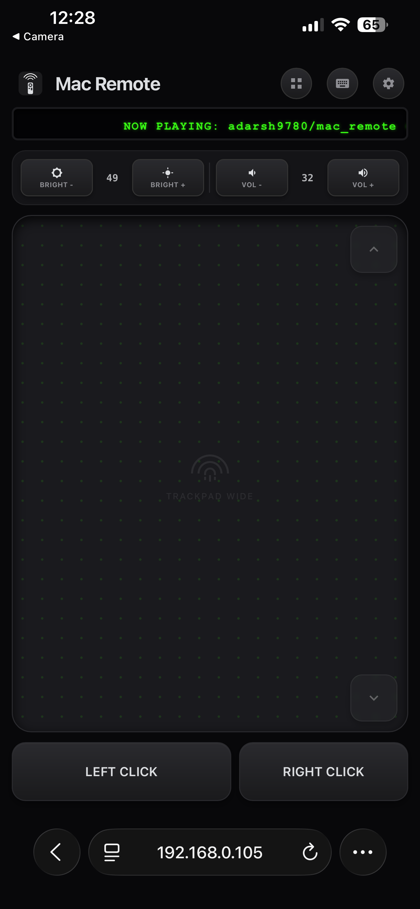
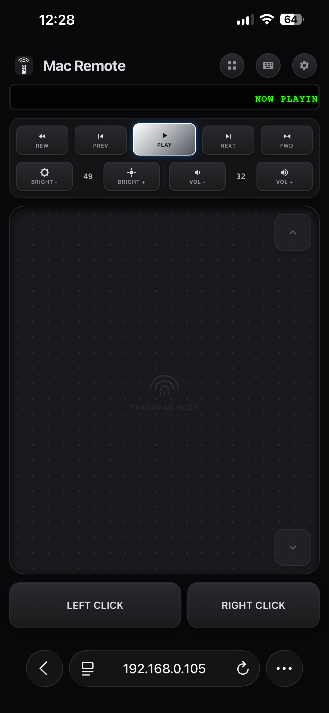
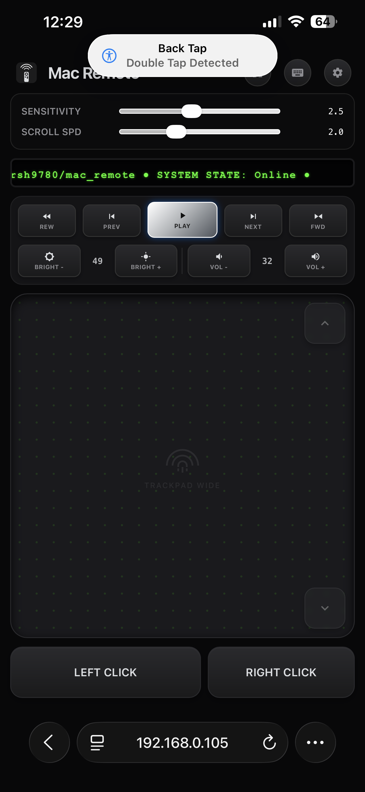
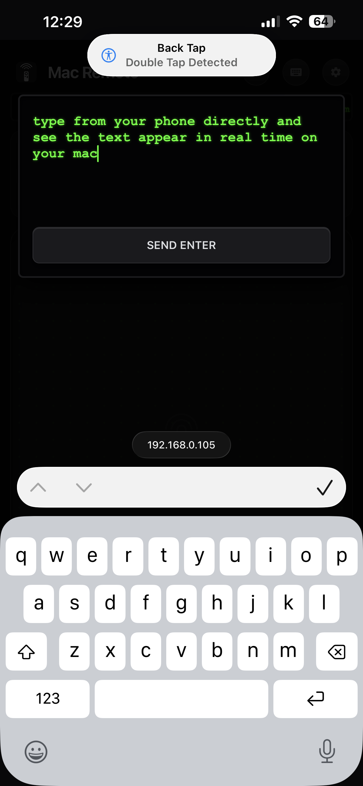

# Mac Remote

Control your Mac from your phone without installing an app.

Mac Remote is a menu bar app for macOS that runs a local web server. Open your phone's browser to your Mac's IP address and you get a control surface: brightness, volume, media playback, a trackpad, a keyboard, and an app switcher. It runs over your Wi-Fi network with nothing to download on the phone.

## Why this exists

Remote control apps have existed for over a decade. Almost all of them require installing a companion app on the phone in addition to the server on the computer. That means two app stores, two installs, and an account or pairing step before you can do anything.

Mac Remote skips the phone side install. The server renders its own UI as a web page. Any phone, tablet, or laptop with a browser on the same network can use it immediately.

## Features

- **Two-Way Synchronization**: If you change the volume, brightness, or media playback directly on your Mac, the web UI instantly updates to reflect the new values.
- **Single Connection Security**: To prevent unauthorized access, only one device can control the Mac at a time. If a new device attempts to connect, it will be securely blocked until the Mac admin explicitly disconnects the current user.
- **Custom OSD Overlay**: When adjusting volume or brightness from your phone, MacRemote displays a beautiful, dark-translucent Heads-Up Display (HUD) on your Mac, seamlessly replacing the native widgets that macOS omits for background apps.
- **Brightness & volume control**, with the current value shown as a number.  
  

- **Media controls** (rewind, previous, play/pause, next, fast-forward) plus a scrolling "Now Playing" readout.  
  

- **Trackpad** for cursor movement, with adjustable pointer sensitivity and scroll speed.  
  

- **Native keyboard typing**, when the Mac's cursor is in a text field, your phone's keyboard types into it. Includes a "Send Enter" action so Return behaves correctly instead of inserting a literal newline.  
  

- **Remote app switcher / Dock view**, see what's running and launch or switch to an app from your phone.  
  

- **Zero install on the client.** Works from Safari, Chrome, or any mobile browser.
- **Minimal footprint.** The app is about 9MB. It uses a Go server for the web UI and logic, with a statically-linked Swift object for the macOS specific calls (brightness, volume, window management). There is no Electron or bundled browser runtime.

## Drawbacks & Security Risks

While Mac Remote is functional, it has several limitations and risks you should be aware of before running it:

- **Unencrypted Transport (HTTP):** Traffic between your phone and the Mac is currently sent over standard HTTP. If someone is monitoring your local network traffic, they could intercept your keystrokes, trackpad movements, or capture your session token.
- **Accessibility Permissions:** The application relies heavily on macOS Accessibility APIs to move the mouse and inject keystrokes. If the application crashes, macOS can sometimes get confused, requiring you to manually toggle the permission off and on again in System Settings.
- **No Wake-on-LAN:** The Mac must be awake to receive inputs. If your Mac goes to sleep, the web interface will disconnect and cannot wake the computer.

## How it works

```
Phone browser  ──HTTP──▶  Go server (menu bar app, :5050)  ──Cgo──▶  Swift object
                                                                    (CoreAudio, brightness,
                                                                     NSWorkspace, CGEvent)
```

The Swift menu bar app starts the Go server and shows status controls (QR code pairing, quit) from the menu bar icon. The Go server serves the control UI and talks directly to the Swift object via Cgo to perform the native macOS actions.

## Comparison

| | **Mac Remote** | Remote Mouse | Unified Remote | Astropad Workbench |
|---|---|---|---|---|
| Install required on phone | **None** | Yes (App Store) | Yes (App Store) | Yes |
| Install required on Mac | Single ~9MB menu bar app | App + license | Server app | App |
| Open source | **Yes** | No | No | No |
| Cost | Free | Free + in-app purchases | Free + paid full version | Subscription ($10/mo or $50/yr) |
| Native brightness/volume control | **Yes, with live readout** | Volume only, via phone hardware buttons | Yes | No (screen-mirroring model) |
| Trackpad | Yes, adjustable sensitivity/scroll | Yes, plus gyro mode | Yes | Mouse input via streamed display |
| Remote app switcher / Dock | **Yes** | No | File manager only | Full screen mirroring instead |
| Typing | Native phone keyboard | Native + voice dictation | Native | Voice/keyboard over a streamed session |

Astropad Workbench solves a different problem (full screen mirroring for remote desktop control) rather than a lightweight native controls panel. It is included since it is a recent entrant in this space.

## Security

Mac Remote is designed to operate on your local area network (LAN). It uses the following measures to restrict access:

- **QR-code & One-time-code pairing**: An on-screen 6-digit one-time code is required before a new device gets control.
- **Brute-force protection**: Automatic lockout after 5 failed OTP attempts.
- **Device Management**: A list of currently connected devices is visible in the Mac menu bar. You can instantly revoke access for any of them.

## Installation

### Method 1: Homebrew (Recommended)

You can easily install MacRemote using Homebrew by tapping this repository:

```bash
brew install adarsh9780/mac_remote/macremote
```

> **Developer Signature Transparency**
> Because MacRemote is a free and open-source project, we currently do not pay the $99/year Apple Developer fee required to cryptographically sign applications. If this project gains enough traction, we will purchase a license!
> 
> Until then, the Homebrew installer will display a pop-up asking if you want to trust the application. If you click **Yes**, the installer will automatically clear macOS Gatekeeper warnings and move the app to your `/Applications` folder.

### Method 2: Build from Source

If you prefer to compile the application yourself, you will need:
- **macOS** 13.0 or later
- **Go** 1.21+
- **Xcode Command Line Tools** (for the Swift compiler)

```bash
# Clone the repository
git clone https://github.com/adarsh9780/mac_remote.git
cd mac_remote

# Build the unified application
make build

# Run the application
open MacRemote.app
```

## First Time Setup

> **Accessibility Permissions**
> MacRemote requires Accessibility permissions to control the mouse, keyboard, and system UI. Upon running the app for the first time, click "Grant Accessibility Permission" from the menu bar to open System Settings, and ensure MacRemote is toggled ON.

Once running, click the menu bar icon and choose "Show QR Code", scan it with your phone, and enter the connection request code displayed on your Mac screen.

## Security Considerations

- **Local Network Only**: MacRemote strictly operates on your local Wi-Fi network and does not route traffic through external servers. 
- **HTTP Transport**: Currently, MacRemote uses standard, unencrypted HTTP. Because the app is designed to be used safely within the confines of a trusted home Wi-Fi network, this provides a frictionless, warning-free user experience. However, if used on public or untrusted Wi-Fi (like a coffee shop), the connection could theoretically be intercepted.
- **Intentional Omission of HTTPS**: We have intentionally decided *not* to implement HTTPS for this local transport. Securing local IP addresses (`192.168.x.x`) requires self-signed certificates, which trigger severe and scary "This Connection Is Not Private" warnings in modern mobile browsers. Bypassing these warnings ruins the premium user experience, so we have chosen to rely on the inherent security of your private home network instead.

## Roadmap

- [x] One-time-code pairing with expiry
- [x] QR-code pairing
- [x] Per-device session list with revoke
- [x] Textured/dotted trackpad surface
- [x] Connection limit (cap on simultaneous connected devices)

## Contributing

Issues and pull requests are welcome.

## License

MIT License
