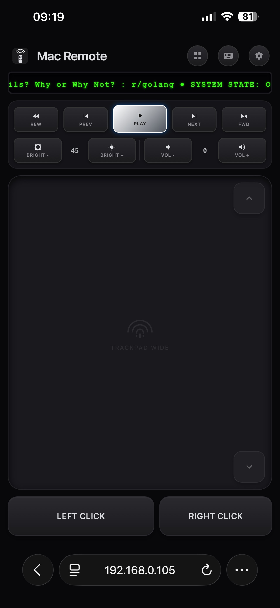
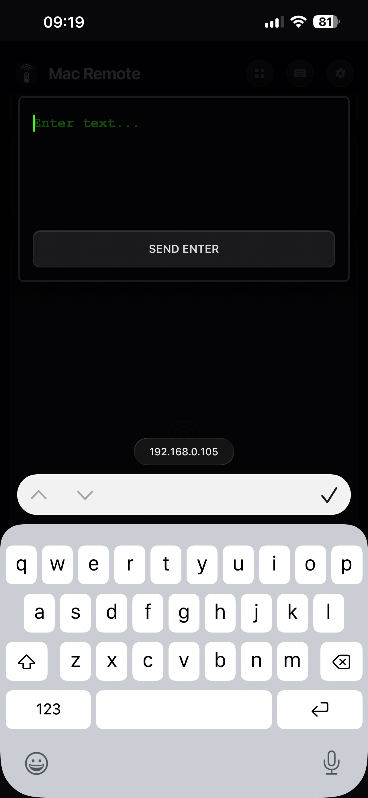
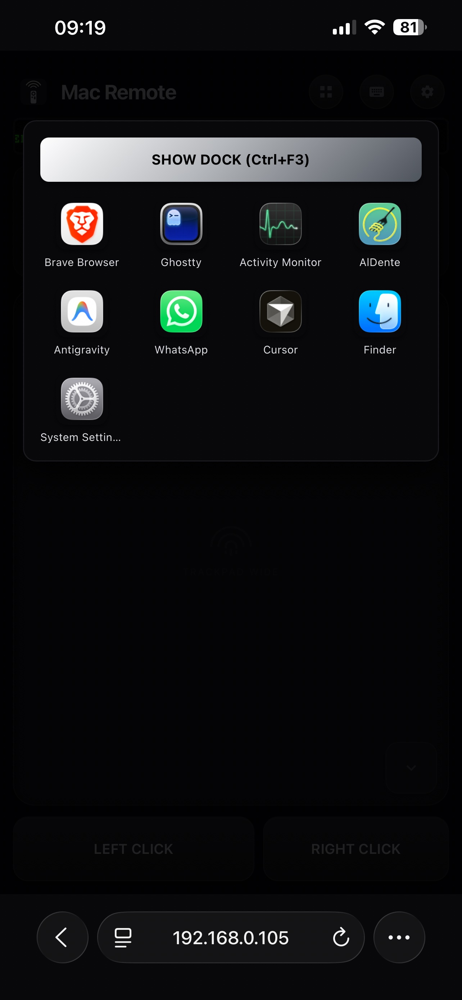

# Mac Remote

Control your Mac from your phone — no app to install, just a browser.

Mac Remote is a tiny menu bar app for macOS that runs a local web server. Open your phone's browser to your Mac's IP address, and you get a full control surface: brightness, volume, media playback, a trackpad, a keyboard, and an app switcher — all running over your own Wi-Fi, with nothing to download on the phone.

---

## Why this exists

Remote-control-your-computer apps have existed for over a decade, but almost all of them — Remote Mouse, Unified Remote, Mobile Mouse, WiFi Mouse — require installing a companion app on the phone in addition to the server on the computer. That's two app stores, two installs, and an account or pairing step before you've done anything.

Mac Remote skips the phone-side install entirely. The server renders its own UI as a regular web page, so any phone, tablet, or laptop with a browser on the same network can use it immediately — including a friend's phone, a borrowed device, or a Mac mini you manage headlessly.

## Screenshots

<p>
  
  
  
</p>

## Features

- **Brightness & volume control**, with the current value shown live as a number, not just an icon.
- **Media controls** (rewind, previous, play/pause, next, fast-forward) plus a scrolling "Now Playing" readout.
- **Full trackpad** for cursor movement, with independently adjustable pointer sensitivity and scroll speed.
- **Native keyboard typing** — when the Mac's cursor is in a text field, your phone's own keyboard types into it directly, including a dedicated "Send Enter" action so Return behaves correctly instead of inserting a literal newline.
- **Remote app switcher / Dock view** — see what's running and launch or switch to any app from your phone, plus a one-tap "Show Dock" shortcut.
- **Zero install on the client.** Works from Safari, Chrome, or any mobile browser — nothing to approve, download, or keep updated on the phone side.
- **Minimal footprint.** The whole app is about 9MB: a Go server handling the web UI and logic, with a single, statically-linked Swift object for the macOS-specific calls (brightness, volume, window/app management) that Go can't reach directly. No Electron, no bundled browser runtime.

## How it works

```
Phone browser  ──HTTP──▶  Go server (menu bar app, :5050)  ──Cgo──▶  Swift object
                                                                    (CoreAudio, brightness,
                                                                     NSWorkspace, CGEvent, …)
```

The Swift menu bar app starts the Go server and shows status/controls (QR code pairing, grant Accessibility permission, quit) from the menu bar icon. The Go server serves the control UI and talks directly to the Swift object via Cgo to perform the actual native macOS actions — keeping the core server lightweight, fast, and unified in a single `.app` bundle.

## Comparison

| | **Mac Remote** | Remote Mouse | Unified Remote | Astropad Workbench |
|---|---|---|---|---|
| Install required on phone | **None — just a browser** | Yes (App Store) | Yes (App Store) | Yes |
| Install required on Mac | Single ~9MB menu bar app | App + license | Server app | App |
| Open source | **Yes** | No | No | No |
| Cost | Free | Free + in-app purchases | Free + paid full version | Subscription ($10/mo or $50/yr) |
| Native brightness/volume control | **Yes, with live readout** | Volume only, via phone hardware buttons | Yes | No (screen-mirroring model, not native controls) |
| Trackpad | Yes, adjustable sensitivity/scroll | Yes, plus gyro mode | Yes | Mouse input via streamed display |
| Remote app switcher / Dock | **Yes** | No | File manager only | Full screen mirroring instead |
| Typing | Native phone keyboard | Native + voice dictation | Native | Voice/keyboard over a streamed session |

Astropad Workbench in particular is solving a different problem — full screen mirroring/streaming for remote desktop control — rather than a lightweight native-controls panel, so it's not a strict apples-to-apples comparison, but it's included since it's the most recent entrant in this space.

## Security

Mac Remote is designed to only operate on your local area network (LAN). It utilizes robust security measures to prevent unauthorized access:

- **QR-code & One-time-code pairing**: An on-screen 6-digit one-time code is required before a new device gets control.
- **Brute-force protection**: Automatic lockout after 5 failed OTP attempts.
- **Device Management**: A visible list of currently connected devices directly in the Mac menu bar, with the ability to instantly revoke access for any of them.

## Getting Started

### Requirements
- **macOS** 13.0 or later
- **Go** 1.21+
- **Xcode Command Line Tools** (for the Swift compiler)

```bash
# Clone
git clone https://github.com/adarsh9780/mac_remote.git
cd mac_remote

# Build the unified application
make build

# Run the application
open MacRemote.app
```

> **Accessibility Permissions**
> MacRemote requires Accessibility permissions to control the mouse, keyboard, and system UI. Upon running the app for the first time, click "Grant Accessibility Permission" from the menu bar to open System Settings, and ensure MacRemote is toggled ON.

Once running, click the menu bar icon and choose "Show QR Code", scan it with your phone, and enter the connection request code displayed on your Mac screen.

## Roadmap

- [x] One-time-code pairing with expiry
- [x] QR-code pairing
- [x] Per-device session list with revoke
- [x] Textured/dotted trackpad surface
- [ ] Connection limit (cap on simultaneous connected devices)
- [ ] HTTPS / encrypted local transport

## Contributing

Issues and pull requests are welcome — this is early-stage and there's plenty of room to help, especially around testing on different macOS versions.

## License

MIT License
